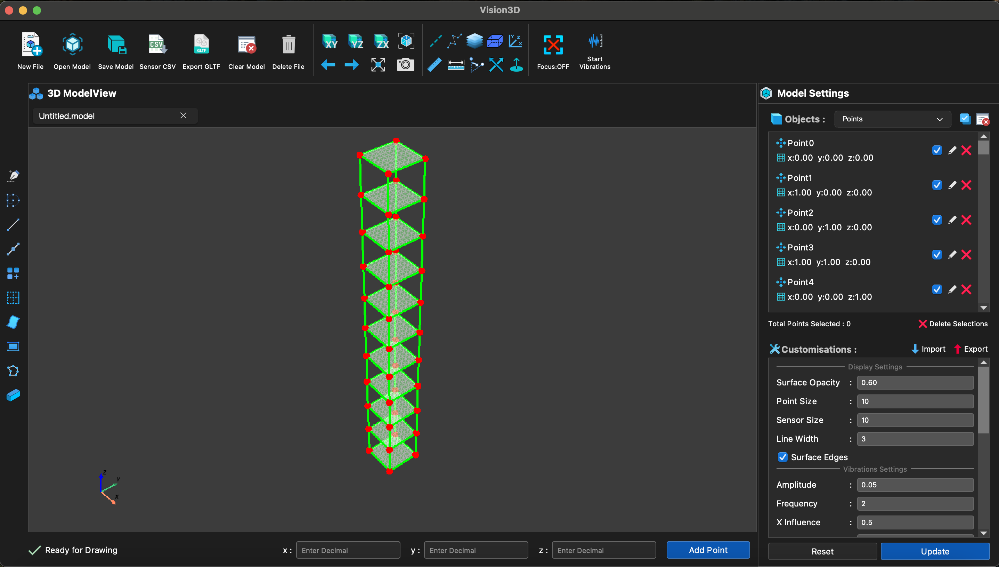

# Vision3D

> **Vision3D** is a powerful and modern 3D geometry modeling software designed for intuitive and precise vector-based modeling. Ideal for engineers, designers, students, and researchers.

## 🖼️ Screenshots

 <!-- Replace with actual screenshot URL -->

---

## 🚀 Features

- 🎨 **Modern UI**  
  Clean, responsive, and user-friendly interface built for efficient workflows.

- 🧭 **3D Vector Geometry Modelling**  
  Support for lines, points, planes, spheres, intersections, vector projections, and more.

- 📐 **Precision Controls**  
  Numeric input, snapping, and constraint-based editing for accurate constructions.

- 🔄 **Real-Time Manipulation**  
  Rotate, scale, and transform models in a real-time 3D environment.

- 🧱 **Object-Oriented Design**  
  Create and manage geometric objects like entities with hierarchical relationships.

- 💾 **Project Save/Load**  
  Easily save your 3D scenes and reload them later for continued work.

- 🌐 **Cross-Platform**  
  Runs on Windows, macOS, and Linux.

---

